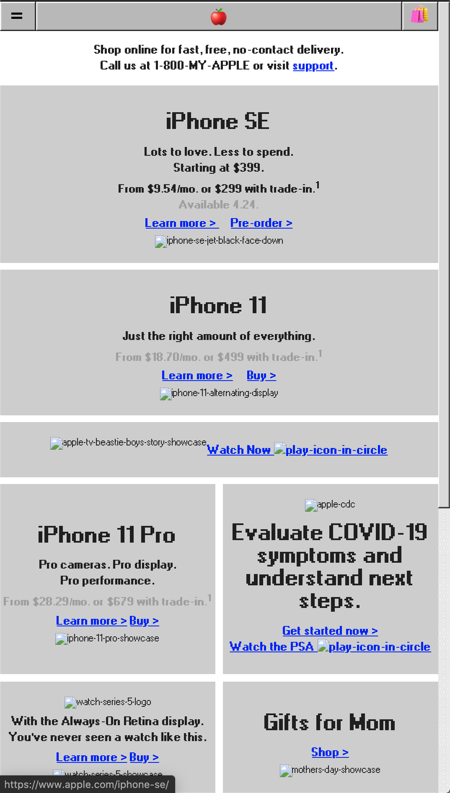
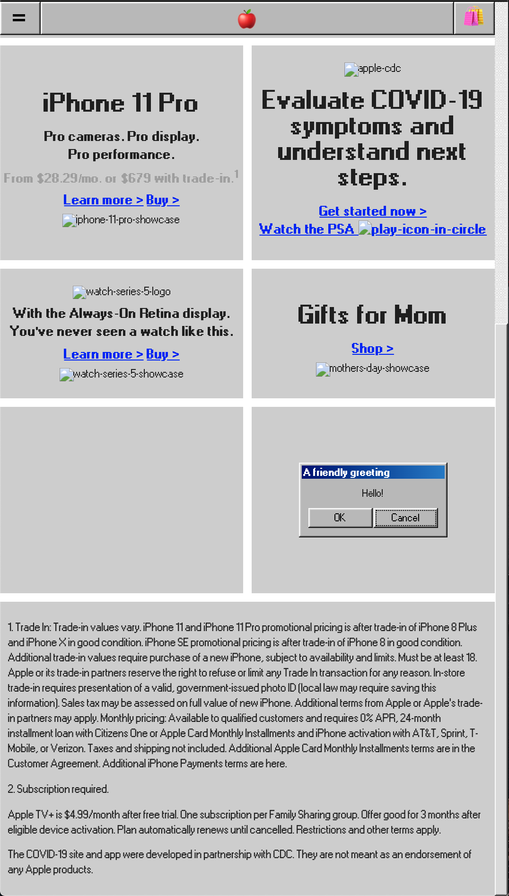
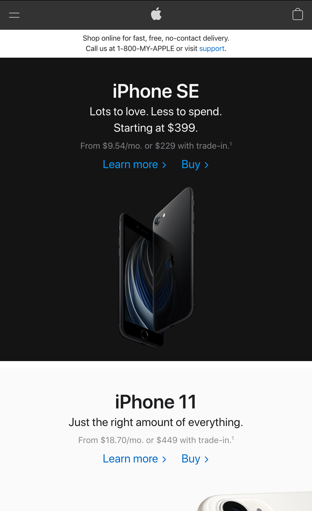

# apple-98

I found a really cool CSS pack on Hacker News: [98.css](https://jdan.github.io/98.css/)

Now it's time to get cookin'. This is my first time playing around with HTML with CSS Grid and Flexbox. I'm pretty new to front-end, but now I want to try getting into full-stack! 

One of the coolest parts was getting the sticky header to work. I wonder how to do it without using JavaScript though. My next project will be creating a site with React and Gatsby!

Check out the semi-ironic Apple.com:

vs.

